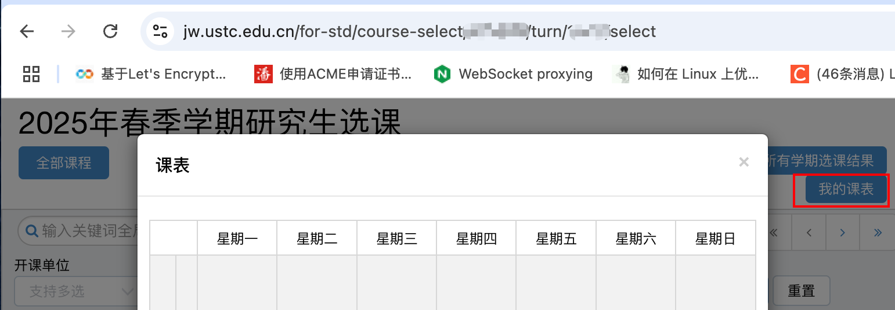
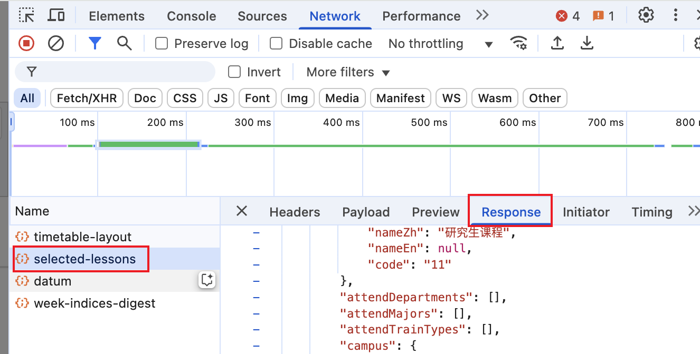

# ustc-course-calendar-to-ics

把USTC课程表转成ics文件，方便导入日历。

## 安装

```bash
pip install pytz
```

## 使用方法

打开 https://jw.ustc.edu.cn/for-std/course-select，打开课表。



按F12打开控制台，找到selected lessons，复制内容，拷贝到本地。



运行

```bash
# example python convert.py your-json.json start-date-of-semester
python convert.py selected-lessons.json 2025-02-23
```
